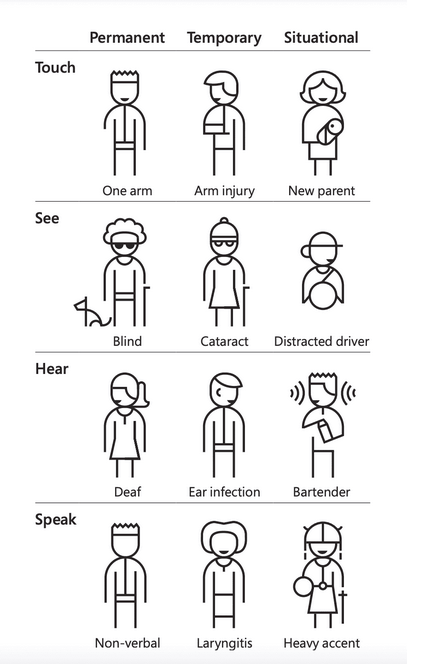

# Design and user experience

-   Always design for best user experience

## Inclusive design

-   Weavs together inclusivity, usability and accessibility

-   Centers on designing for a specific individual or use case and then extending that design to include others
-   Universal design is a single design that can be used by as many people as possible

### 7 inclusive design principles

    1. Provide comparable experience: Ensure your interface provides an equal experience for all, so people can accomplish tasks in a way that suits their needs without undermining the quality of the content.

    2. Consider the situation: Make sure your interface delivers a valuable experience to people, regardless of their circumstances.

    3. Be consistent: Use familiar conventions and apply them in a logical manner.

    4. Give control: Ensure people can access and interact with content in their preferred way.

    5. Offer choice: Consider providing different ways for people to complete tasks, especially those that are complex or non-standard.

    6. Prioritize content: Help users focus on core tasks, features, and information by arranging these elements in the preferred order within the content and layout.

    7. Add value: Consider the purpose and significance of features and how they improve the experience for different users.

## Personas

-   Ficittious characters that use the product, often based on quantitative or qualitative research.
-   Way to test features in the design and development process.
-   Adds consideration to help focus on specific users

### Disability simulators

[!Caution]
**_Use with extreme cauton_**

-   Can lead to wrong outcomes
-   Better to learn from people with first hand knowledeg or experience
    -   Demos
    -   Tutorials
    -   Interviews

## Accessibility heuristics

-   Rules for interaction design
-   Can reduce a huge amount of bugs if accessibility is included in the design process
-   These can all be applied to persona's or used in the design process

### 10 heuristics

-   Interaction methods and modalities: Users can efficiently interact with the system using the input method of their choosing (such as a mouse, keyboard, touch, etc.).

-   Navigation and wayfinding: Users can navigate, find content, and determine where they are, at all times, within the system.

-   Structure and semantics: Users can make sense of the structure of the content on each page and understand how to operate within the system.

-   Error prevention and states: Interactive controls have persistent, meaningful instructions to help prevent mistakes, and provide users with clear error states which indicate what the problems are and how to fix them whenever errors are returned.

-   Contrast and legibility: Users can easily distinguish and read text and other meaningful information.

-   Language and readability: Users can easily read and understand the content.

-   Predictability and consistency: Users can predict each element's purpose. It's clear how each element relates to the system as a whole.

-   Timing and preservation: Users are given enough time to complete their tasks and don't lose information if their time (i.e., a session) runs out.

-   Movement and flashing: Users can stop elements on the page that move, flash, or are animated. Users shouldn't be distracted or otherwise harmed by these elements.

-   Visual and auditory alternatives: Users can access text-based alternatives for any visual or auditory content which conveys information.

## Accessibility annotations

-   Used to indicate where more accessible choices can be made in the coding from the design team or accessibility specialist
-   Can be used at any stage of the design and development process, should probably be regularly done

-   Some areas to consider for accessibility annotations include:

    -   Color: include contrast ratios of all of the different combinations of colors in the palette.
    -   Buttons and links: identify default, hover, active, focus, and disabled states.
    -   Skip links: highlight the hidden and visible design aspects and where they link to on the page.
    -   Images and icons: add alternative text recommendations for essential images and icons.
    -   Audio and video: highlight areas and links for captions, transcripts, and audio descriptions.
    -   Headings: add programmatic levels and include everything that looks like a heading.
    -   Landmarks: highlight the different sections of the design with HTML or ARIA.
    -   Interactive components: identify clickable elements, hover effects, focus area.
    -   Keyboard: identify where the focus should start (alpha stop) and the following tab order.
    -   Forms: add field labels, helper text, error messages, and success messages.
    -   Accessible names: identify how assistive technology should recognize the element.
