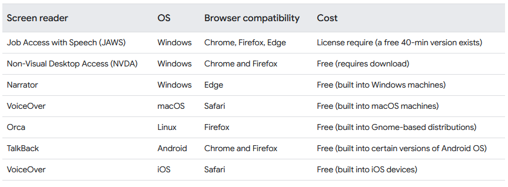

# Patterns, components, and design systems

-   How do you know which patterns are best when it comes to accessibility? Should you use an established pattern or library, or create new ones? How do you know if these patterns will actually help your users?

## Think critically

-   Lots of different options

-   Does an established pattern, component or design system aleady exist?
-   What browsers and AT's am I supporting?
-   Are there code or framework limitations?
-   Any other integrations, factors, or user needs that I need to think about?

## Established resources

-   Research first instead of building brand new, there might already be something out there

    -   [Check out a whole lot of resources here](https://web.dev/learn/accessibility/patterns#established_resources)

[!IMPORTANT]
**_Don't just copy paste and assume it will work, take time to understand it and test as much as possible!_**

## Browsers and AT support

-   Screen readers were built with specific browsers in mind and work bst with those specific ones

Resources such as [HTML5 Accessibility](https://stevefaulkner.github.io/HTML5accessibility/), [Accessibility Support](https://a11ysupport.io/), and [WCAG's Custom Control Accessible Development Checklist](https://w3c.github.io/using-aria/#checklist) help us to better understand current browser and AT device support, and even when to use ARIA in the first place.

## Other considerations

-   Frameworks, CMS's and other things may cause limitations to which patterns you can use

    -   Performance
    -   Security
    -   SEO
    -   Language translation support
    -   Third-party integrations

-   Make sure pattern choice is accessible for both users and developers.
