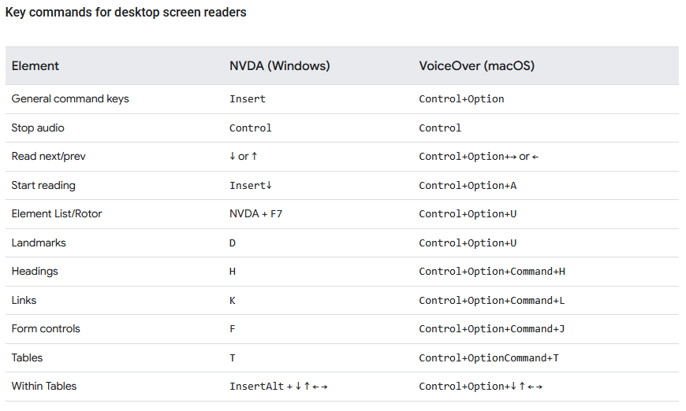
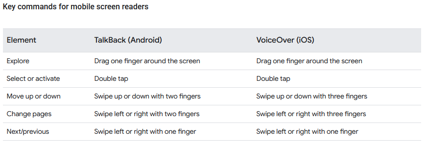

# Assistive tech testing

## Screen reader testing basics

-   Most popular screen readers are JAWS, NVDA, VoiceOver for desktop and VoiceOver and Talkback for mobile
    -   There are prefered pairings with these, using a screen reader with its not prefered browser might run into bugs or unexpected behaviors

JAWS : Windows : Chrome, Firefox, Edge
NVDA : Windows : Chrome, Firefox
Narrator : Windows : Edge
VoiceOver : Mac : safari
Orca : Linux : Firefox
TalkBack : Android : Chrome, Firefox
VoiceOver (mobile) : iOS : Safari
ChromeVox : ChromeOS : Chrome

> [!IMPORTANT]
> When using a screen reader for accessibility testing, your goal is to detect problems in your code that interfere with the usage of your website or app, not to emulate the experience of a screen reader user. Remember that using an AT to test code against a set of rules and asking users about their experience often yields different results. Both are important aspects to create fully inclusive products.

